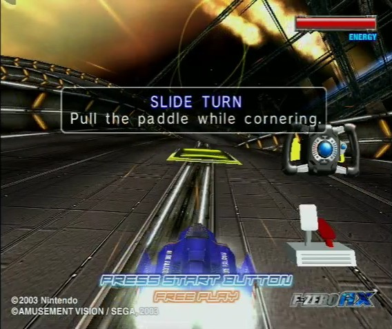
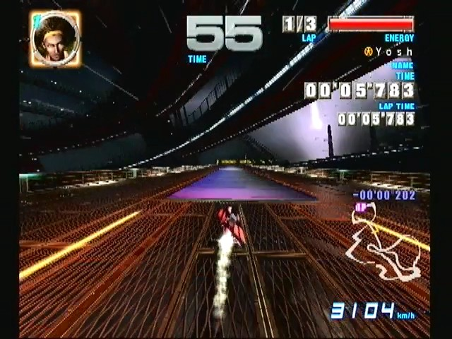
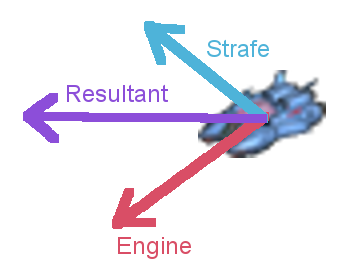

# F-Zero AX mechanics differences from GX

This article describes how the driving mechanics and techniques of F-Zero AX differ from those of F-Zero GX.

## Controls

Before delving into mechanics differences, it helps to know how the basic controls differ between games.

|    | GX, Gamecube controller (default mapping) | AX, arcade cabinet |
| -- | -- | -- |
| Steer left/right | Push control stick left/right | Turn steering wheel left/right |
| Nose up/down | Push control stick down/up | Tilt steering wheel back/forward |
| Strafe | Press L/R shoulder buttons; analog inputs\* | Pull yellow paddles at the back of the steering wheel; digital inputs |
| Accelerate | Press A button; digital input\*\* | Press right foot pedal; analog input |
| Brake | Press B button; digital input\*\* | Press left foot pedal; analog input |
| Boost | Press Y button | Press either the large blue button at the center of the steering wheel, or the small blue button between the center and the right handle |
| Side attack | Press X button + left or right | Pull one of the strafe paddles twice (like F-Zero X) |
| Spin attack | Press Z button + left or right | Steer while holding both strafe paddles |

\* With a different button mapping, these inputs can be digital in GX, but there is no known benefit to mapping it this way.

\*\* With a different button mapping, these inputs can be analog in GX ([Video](https://www.youtube.com/watch?v=cEtneG44I_I)), but there is no known benefit to mapping it this way.

When playing AX on Nintendont, the AX controls are remapped to a Gamecube controller - with stick, L, R, A, B, and Y doing what you'd expect them to do. The strafe inputs are still digital, though.

## Rocket start

AX has a rocket start mechanic which requires you to time your engine start during the 3-2-1 countdown.

This mechanic is similar to the 2D F-Zero games (SNES, MV, GPL, Climax), but AX's 'rocket' effect is less pronounced. An AX rocket start will look a lot like a normal GX start, with steady acceleration from a low speed. An AX overheat start (going too early) will have some initial acceleration, followed by roughly 1 second of deceleration, then acceleration again.

As shown in [this Famicco video guide](https://youtu.be/VWf5w7j9CoQ?t=225") (at 3:45), you need to push the accelerator between the '2' and '1' to get the optimal start; specifically, just as the '1' starts to appear visually on the countdown monitors. The timing does not seem to change depending on your machine or setting. For example, the Famicco guide shows Fire Stingray at high max speed settings. The same timing also works with Fat Shark at max acceleration.

In GX, all you have to do is start holding A anytime before the '1', and you'll get the optimal start. The exact amount that you can delay the A press isn't documented, but it's close to when the announcer says '1'.

## Making sharp turns

Some turns are so sharp that a simple *slide turn* (steer+strafe left or steer+strafe right) is not enough to make the turn without hitting the wall, especially at boosted speeds. GX and AX have very different techniques for turning more sharply, and this is perhaps the most fundamental way that the mechanics of the two games feel different.

### GX: Quick turns

GX has the *quick turn* technique; it's basically a slide turn with loosened grip. To quick turn left, you tap right strafe, then steer+strafe left.

Quick turns generally give you a ton of control over your angle, although it feels more responsive with some machines (like Blue Falcon) and more sluggish with other machines (like Black Bull).

### AX: Drift turns

In AX, grip works very differently. Pressing both strafe paddles doesn't have any grip-breaking effect, so the quick turn inputs don't do anything special.

Instead, AX has the *drift turn*. This also involves turning with loosened grip, but the method of loosening grip is lightly tapping the brake. So you tap and release the brake (a partial tap is fine - remember, brake is analog) while starting to steer, optionally adding strafe as well.

With drift turns, the control is not as tight as with GX quick turns - your possible turn angles are limited, and quite dependent on your machine and settings. For example, when Fat Shark does a hard drift turn, it has a major tendency to slide out wide (to the opposite direction of the turn). So you have to start your turn early to compensate, and you may have to re-press the accelerator near the end of the turn to avoid crashing into the outer wall.

It's probably fair to say that the level of control is more on par with a GX MTS (momentum turbo slide) than a quick turn.

## T-Drift

T-drift is an AX-only technique, and also AX's most powerful technique. Without T-drift, the fastest AX records (without checkpoint skips) would be much slower than the GX Max Speed records. But thanks to T-drift, AX records are about on par with GX Snaking records.

[Here's a video tutorial for T-drift](https://www.youtube.com/watch?v=TC07KEB7K0g). I'll summarize the most relevant info here, though.

[Officially](http://backup.segakore.fr/f-zero.jp/f-zero_ax/technique/index.html), a drift turn in AX doesn't require the strafe paddle; it just involves loosening grip and steering. But if you strafe in the same direction as your drift turn at high-acceleration settings, you can rapidly gain speed as long as the drift turn goes on. A strafing drift turn is called a *T-Drift (Turbo Drift)*.

Most machines in AX can gain speed rapidly as long as the T-drift lasts. However, most machines need to continuously steer to keep the T-drift going. Once they stop steering, the drift (and the speed gain) ends. For machines that have tight drift turns, like Blue Falcon, there are very few opportunities to hold a single T-drift for more than a second. Wider-turning machines like Fat Shark fare better.

The best T-drifters in the game, by far, are the ones which can keep the T-drift going without steering.  Only custom machines are known to do this - some examples are Aerial Whale-EX, Dark Condor, and Heat Dragon-EX. By simply strafing and driving straight, they can keep the T-drift going - [breaking 4000 km/h in Sonic Oval](https://www.youtube.com/watch?v=PzR4DBUBLWo), and regularly surpassing 2500 km/h even in technical courses like [Thunder Road](https://www.youtube.com/watch?v=skGuP-GJVaE).

In Japanese, T-drift has an official name - 合力ドリフト, "gouriki drift" or "resultant force drift". The idea is that your engine force and strafing force combine (using vector addition) to get your diagonally-facing resultant force, which is greater than the engine force alone. It's unknown if this is actually how T-drift works, though.

T-drift was apparently first known as ドリフトターボ "drift turbo" in Japanese 2channel discussions, dated June 2003. When word of the technique made its way to Western communities, it was shortened to T-drift. ([Video explanation](https://youtu.be/59NhyWuepvU?t=275), 4:35) The origin of the term 合力ドリフト is unclear, but that is what the [official F-Zero AX homepage](https://web.archive.org/web/20110709094914/http://am.sega.jp/utop/urawaza/index.html) called the technique, and that term was used or acknowledged in Japanese AX players' homepages (such as [hamaken's](https://web.archive.org/web/20051125003246/http://hamaken.s5.xrea.com/fzero/ax_8.htm) and [152's](https://web.archive.org/web/20181107223127/http://www.geocities.co.jp/MotorCity-Circuit/8346/technique.html)).

## Snaking isn't the same

Snaking in GX is basically doing quick turns repeatedly. In a similar vein, you can do T-drifts repeatedly in AX, although it has quite a different feel.

Recall that in AX, steering while holding both strafe paddles makes you do a spin attack. So in AX, consecutive T-drifts need a slight gap between them to avoid accidental spin attacks. That brief interval of not T-drifting is enough to make your speed dip significantly, so you can't maintain speeds as high as GX snaking; and the viability of rapid "micro-snaking" (used on thin roads) is especially limited compared to GX.

In AX, it's much better to hold a single T-drift through a straightaway if you're using a custom machine that can do that. If you're using a machine like Fat Shark instead, T-drift snaking may help on some straightaways, but on others it may be faster to just gain speed from the preceding turn and then MT (release accel).

On the other hand, snaking in the air (used in spaceflying) is quite similar to GX. The fact that you need to let go of one strafe entirely before pressing the other (to avoid spin attacks) does make it a little trickier in AX, though.

## No MTS (or TS)

In GX, you can turn at high speeds if you break your grip and hold the opposite shoulder button while steering (e.g. left steer + R). This typically works best when the engine is off, in which case it's called *Momentum Turbo Slide* (MTS); in some low speed cases it's better to keep the engine on, and that case is called *Turbo Slide* (TS).

Nothing special happens when attempting MTS or TS inputs (steering and strafing in opposite directions) in AX. An MTS might gain a tiny bit of speed initially, but no more than a regular strafing turn would; after that, you don't gain any more speed. A TS doesn't seem to gain any speed.

*Momentum turbo rail slide (MTRS)* is similarly much less effective than in GX, although it may benefit a minor amount compared to simply driving straight. Still, it generally seems better to hold a T-drift to the finish line instead.

## Other notes

MT (momentum throttle) and shift boosts work the same way in both GX and AX.

It's unknown whether side attack techniques (such as side attack dives) are viable in AX. Repeated side attacks would be much more difficult than in GX because the strafe has to be pressed twice.

## Summary

The biggest takeaway is that **AX drifting and grip physics are totally different from GX**, giving a
very different feel to the game as soon as you try anything beyond basic steering and strafing. Most of the advanced techniques in GX rely on the specifics of how grip works in that game - and similarly for AX. If you've played a decent amount of GX, you should notice a big difference in handling when trying AX.

## What mechanics are used when playing "AX mode" using cheats in GX?

That uses entirely GX mechanics. It's somewhat like playing a mod of one game with assets taken from another game. If you want the authentic AX experience, play AX on Nintendont or on an arcade cabinet!

