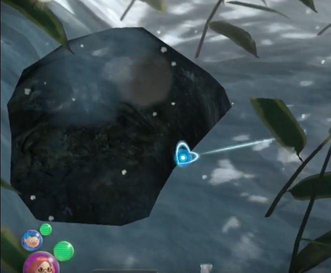
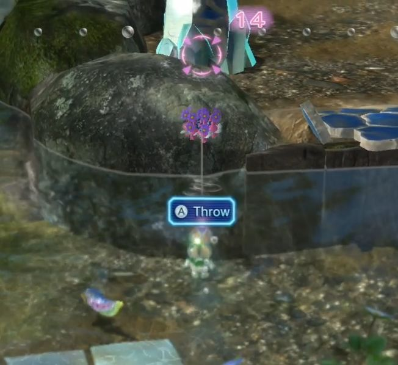

# Any% Normal speedrun notes

## Practice files

You'll want one file which follows the Any% route, and probably a second file which lets you practice the latter parts of Days 2, 3, 5, and 7 - the days which can be reasonably split up for practice.

The plan:

- Garden of Hope:
  - 1st day - follow the any% route until you have 60 Pikmin, then end day
  - 2nd day - do the rest
- Distant Tundra:
  - 1st day - activate the Yellow Onion, reunite the captains, push the bag which lets you shortcut to the boss room, get at least 4 bottles' worth of juice, end day. Finish with 67 red, 14 rock, however many yellow.
    - 2 cherries, loquat, grapes, and strawberry will do it.
  - 2nd day - just the boss. Remember to bring only one captain, 67 red, 14 rock, and 5 yellow to practice.
- Twilight River:
  - 1st day - follow the any% route until you're out of the first area. Then push the bag which lets you shortcut to the second area, blow up the bomb rock wall next to the Onion, and end day.
  - 2nd day - when practicing, note that the Pikmin bringing back the berries will behave differently.
- Formidable Oak:
  - 1st day - make the shortest path, including blowing up the stone gate near the start, growing all the flower platforms, and tearing down the gates near the end. Make sure to actually exit the cave so you can 'go here' later. End day.
  - 2nd day - just the boss. Make Brittany 'go here' to the cave exit while Alph and Charlie get the bomb rocks. Once Brittany has arrived and the Pikmin have brought Olimar to her position, exit the cave and practice the boss.

## Miscellaneous mechanics

- After you charge Pikmin with X, your captain's maneuverability will be hampered somewhat. You'll have trouble changing direction. So if your intention is to charge Pikmin at something and then move away, you might want to start walking away before pressing X, rather than after. The fact that you are walking away shouldn't affect the Pikmin's ability to reach their charging destination.
  - Also, if you're in a situation where you can repeatedly press X, that will help keep some of your maneuverability compared to just pressing X once.
- "Go Here" on the Koppad
  - You can only go to locations you've traveled with a currently-active captain (not a tossed captain or Pikmin), or locations within a small radius of where you've traveled to.
  - If you return to a previous day in a save file, the Koppad's map progress doesn't roll back. So if you're replaying Day 2, you can "Go Here" to a place you've been to on the saved Day 2 or Day 6 of that file.

## Miscellaneous run notes

- Times to drink water or stretch
  - After ending Day 1: OK
  - After skipping the zoom-in into the S.S. Drake to start Day 2, 3, 5, or 7: OK
  - After ending Day 2, 5, or 6: Good

## DAY 1

### Charlie's section

- Walk toward the can on the left. Hug the wall when you get close, as that should trigger the cutscene sooner.
  
- Do a short whistle on the yellow Pikmin, since the next part starts when you stop whistling.
  
- Toss the yellow Pikmin anywhere.
  
  - Try to toss them rhythmically as fast as the game lets you. Mashing is slower. This goes for any part where you're tossing multiple Pikmin in a row.
  
- Whistle the yellow Pikmin over. Toss them on the small mushrooms to clear a path.
  
- Just past the small mushrooms, offscreen on the right are a group of yellow Pikmin. Whistle them over if you can (but it doesn't really matter if you miss since they'll all be gathered at the screen transition). Then start tossing Pikmin onto the large mushroom on the left.
  
  - You could also toss a couple at the small mushrooms on the left in advance, this could make it a bit easier to focus aim on the left mushroom.
  
- Walk to the Phosbat cutscene.

### Alph's section start

- Walk to the Red Onion.
- Whistle the red Pikmin over. Lock onto the Onion. Toss the Pikmin onto the Onion.
- Toss the 3 red Pikmin to 3 of the bridge pieces; doesn't matter which ones. Try to do this before reaching the point where Alph stops with "What's this pile of rubble?".
- Whistle the lone red Pikmin and dismiss it so that it goes for a bridge piece.
- Focus on speeding up the 3 Pikmin instead of the lone one. Push them while they're carrying bridge pieces. Once they've tossed in the pieces they're carrying, whistle them and then toss them to the pile again; since they're leaves, this'll be faster than letting them walk back themselves.
  
  - Be careful not to call them back before they toss in the pieces though, otherwise the pieces will despawn and reappear in the pile they came from.
- As the last bridge pieces get tossed in, turn the camera around and do a long whistle at the (now empty) bridge piece pile. Keep whistling until the cutscene happens. After the cutscene, all 4 Red Pikmin should be following right behind you.
  - If you messed up the whistle: after the cutscene, you'll have to call back the Pikmin which are heading back to the (now empty) bridge piece pile.
- Walk forward to activate the KopPad tutorial. Press the left stick inward to speed up movement, and tilt it up-left to move there; meanwhile, tilt the right stick down to zoom out to further speed up movement.

### Alph's section after the bridge

- You should have 4 red Pikmin with you (or trying to catch up to you). Toss 1 red Pikmin onto each of 3 pellet posies.
  
- Make the sheargrubs come out as early as possible by walking there. When the 4th red Pikmin catches up, try to toss it onto the sheargrubs a couple times (3+ tosses runs the risk of you losing time by getting back to the Onion late). After those 2 toss attempts, toss the 4th Pikmin up to the 5-pellet posy's stalk so that the Pikmin starts attacking it.
  
- Return to the Onion and pluck the 6 red Pikmin sprouted from the 3 1-pellets.
  
  - General tip: To pluck faster, after the pluck animation starts, press B to cancel the animation so you can immediately start walking to another sprout. Note that after the A press, your captain has to actually reach the sprout, then the pluck animation starts - then you should press B.
  
- With 9 red Pikmin in tow, walk back to the sheargrubs area. Toss red Pikmin at the sheargrubs as early as possible so that the remaining ones come out from underground. Overall, toss 4 at the sheargrubs and hopefully defeat more of them in the process. Then toss 4 Pikmin at the 5-pellet (to join the 1 you left there) and 1 at the 1-pellet posy. Then make sure the first 4 Pikmin clean up the sheargrubs.
  
- Walk back to the Onion. Pluck Pikmin sprouted from the sheargrubs when available, and toss onto the pellets to speed them up. If you can, make the 5-pellet come in slightly after a sheargrub or 1-pellet comes in, so that the 5-pellet sprouts come out faster. Not sure on the exact timing here though, need to check.
  
- Pluck everything. Head to the box with 21 red Pikmin in tow. Charge them at the box.
  
- Head into the cave.
  
- Dodge the data file. Turn the camera left to move the right mushrooms offscreen. This should avoid Alph's dialogue commenting on the big mushrooms.
  
- Once the gate cutscene finishes, aim at the gate and mash X to charge your Pikmin at it.
  
- Head out of the cave to finish the day.

### Cutscenes

- Speed up the juice drinking by pressing +.

## DAY 2 - Garden of Hope

Overview: At the end of the day we'll have 67 Red and 14 Rock Pikmin (assuming no Pikmin losses), ideally all flowered. It's OK to have a few less Pikmin, but having more will make tasks faster/easier later in the run. Some players grow 1 more Red Pikmin from the butterfly near the Onion.

### Cutscenes

- After the "Exploration Day 2" text, press + to skip the camera zoom into the S.S. Drake.
- For text skipping, A can advance to the next text box when the previous one is done. B can do that and also skip a box's text scrolling. Mashing A and B alternately won't help unless you have very good timing with it. Easiest to mash B.
- After selecting "Land" on the map, press + to skip the cutscene of the S.S. Drake and Onion flying toward the planet.
- After the objective text "Where's Brittany?" disappears, press + to skip the cutscene of the S.S. Drake and Onion landing on the planet.

### Start

- Walk toward the Onion. After the cutscene, Alph will be standing directly under the Onion, so don't move and just press A. Take out all 21 red Pikmin.
  
- Toss 8 on the gate, 1 on the pellet posy. Turn the camera left and start walking to the bridge. Toss 5 to the side around the plants. Toss 7 across the incomplete bridge.
  
- As Alph only, walk into the water to the left of the incomplete bridge. Whistle the 7 Pikmin once you're far enough to not make them walk into the water. Walk close to the gate, lock onto it, and mash X to make the Pikmin charge onto it. Make sure all 7 get on.
  
- Walk back and call the 5 Pikmin in the plants + 1 at the Onion. Toss 3 Pikmin onto the Dwarf Red Bulborb to defeat it and carry it back. But if it's close to the bridge pieces, call the Pikmin back to re-toss, because you only want 1 Pikmin going to build the bridge. Toss 2 at pellet posies, 1 at bridge pieces, 3 at Dwarf Bulborb if necessary.
  
- Pluck the 2 red Pikmin at the Onion, then toss them to the Dwarf Bulborb to speed it up (5/3). When stuff gets back, toss 6 more Pikmin at the bridge pieces, so that there are 7 total working on the bridge. (Alternatively, you could have called that 1 Pikmin back earlier, in which case you'd be tossing 7)
  
- Toss the 1 Pikmin you have at the gate. Pluck the Pikmin sprouts and toss them at the gate until it's finished. Head past the gate with 16.
  
- Toss 1 Pikmin on the right egg, 6 or 7 on the left. Charge the rest of the Pikmin to the right nectar. This should flower all 16. Charge your group at the bridge pieces (this should direct 14 there). Toss 1 (at the pellet posy.
  
  - Or maybe toss 2 so that they finish faster, and then you can call both Pikmin back before crossing the bridge?
  
- You should see a bunch of Pikmin finishing up the bridge. Call them back before they return to the empty bridge piece piles. Do not actually cross the bridge till it's actually fallen down, otherwise there is a chance of Pikmin getting left behind at the corners for whatever reason.

### After the first bridge

- Cross the bridge. Toss 2 Pikmin at the pellet posies on the right. Charge your remaining Pikmin at the Red Bulborb's side to take it out. Once it's defeated, call those Pikmin back and then re-charge so that exactly 10 (the carry amount) get on. Proceed with the remaining Pikmin past the gate.
  
  - Do not call back the 7 leaves on the gate to charge at the Bulborb. You want only flowers to carry the Bulborb, so that you can bring all the leaves there to the nectar ahead.
    
  - There are faster strats for getting the correct number of Pikmin on the Bulborb, but this'll do for now.
  
- Walk past the gate and into the Rock Onion cave.
  
- Defeat the jellyfloat. Aim at the ground slightly past its shadow and press ZR to lock onto it. Its pattern is erratic, and it might drop its jelly immediately, so be wary. (I don't quite know the nuances on fighting this yet)
  
- After the cutscene, call the 6 Rock Pikmin and then charge them at the crystal. Once they hit the crystal, whistle and charge again. It takes 10 hits so you have room to mess up a bit.
  
- Walk back and pick up the Red Pikmin; leave the Rock Pikmin to start carrying the jellyfloat. Toss up to 6 Red Pikmin at the jellyfloat, to help with the carrying while not outnumbering the Rock Pikmin. Pluck all 8 of the sprouts. Exit the cave.
### After the Rock Onion cave

- Dodge the data file, then walk near the glass wall and charge all your Rock Pikmin at it. Do this before walking too far forward, which will make Alph stop and say "Brittany is on the other side of this wall."
  
- Toss about 4 Red Pikmin at the strawberry.
  
  - This is a beginner/intermediate strat; there is another fruit route (getting a fruit in Twilight River instead) which saves half a second.
  
- When the glass wall is down, walk past it, then toss 1 Red Pikmin at the 2 eggs at the right. Walk toward the glass wall blocking Brittany, and toss 1 Red Pikmin at the egg there. Point at the glass wall and charge your Rock Pikmin there. Then point at the nectar and charge your Red Pikmin.
  
- Once the glass wall is down, skip the cutscene, then toss Brittany and at least 5 Pikmin onto the step.
  
  - Tossing at the extreme right side of this step might make Brittany say you're not tossing to the right place. It's not that easy to have happen though.
  
- After skipping that dialogue, whistle Brittany, whistle the Pikmin at the close nectar, then move to the farther 2 nectar drops. Flower all your remaining leaf Pikmin there. Optimally, you'd toss some leaves at one nectar drop and then charge the rest at the second nectar drop. Your remaining leaves should all be Rock Pikmin hopefully, which should help.
  
- As you pass the first glass wall, whistle at the corners of the wall just in case any Pikmin got stuck there. It can happen.
  
- Walk all the way back to the Onion.
  
- As you approach the Onion, whistle the idle Red Pikmin around the Onion so that you can identify the sprouts more easily. Toss Brittany toward the sprouts so she starts plucking. Charge your Rock Pikmin at the glass wall past the Onion. Then finish plucking as Alph.
  
- At this point you should have 46 Red Pikmin and 14 Rock Pikmin, for 60 total. If you want to practice the latter part of this day, this is a good place to split up practice.

### After getting 60 Pikmin

- Walk past the downed glass wall. Toss Rock Pikmin to break the two eggs on the right. If the Fiery Blowhog is threateningly close, consider charging your Red Pikmin to take it out and make life easier. Either way, you'll want to flower your newly-plucked Red Pikmin using the nectar there.
- Toss 1 Red Pikmin on one Fiery Blowhog if both are still alive. Toss 1 Red Pikmin at the 5-pellet posy. Toss 5 Red Pikmin at one Fiery Blowhog so that they bring that one back. Take the rest of your Pikmin to the water crossing spot.
  - Tossing 5 at the blowhog farther from the Onion should make the end of day's carrying work slightly quicker.
- Toss Brittany and all your Pikmin across the water. Switch to Brittany, then toss 6 Rock Pikmin at the crystal at right. Charge the rest of your Pikmin at the gate; get close enough so the charge gets them all onto the gate.
  - There are faster, slightly more complex strats for distributing Pikmin here, but this is a relatively simple way.
  - There's a way to get the Pikmin to swim across instead of tossing them over, but this guide doesn't cover it yet.
- Walk back to the 6 Rock Pikmin; they should have broken the crystal there. Get 3 of them carrying the bridge pieces on that side, and toss the other 3 to the bridge pieces on the other side.
- Switch to Alph. Walk back to the Onion, close enough to start plucking, and switch back to Brittany.
- Wait for the gate to get torn down, then bring the Pikmin at the gate to the boss area.

### Armored Mawdad

- Walk around the Mawdad, and toss Rock Pikmin at the tip of its tail once it stops moving. If you tossed too early, the tail might flip up, making it hard to hit. It takes 5 hits to break the armor at the tip of the tail.
  
- Call all your Pikmin back, then charge everyone at the tip of the tail once the Mawdad stops moving. But the Mawdad might choose to scurry along the walls for a while if you get unlucky. Ideally it just stops after going up the wall a bit.
  
- Allow the Pikmin to attack the Mawdad until it has the smallest sliver of health, or very close to that. (The Mawdad can't be drained to 0 health while it's on the wall, so that's the best you can do.)
  
- Now, you can either choose to call your Pikmin back early enough so that the Mawdad starts walking slowly, or you can keep them on so that the Mawdad starts running fast. Slow walking can potentially save time but can also potentially lose time. Running fast seems more of a stable strat but can't be optimal.
  
- Once the Mawdad is off the wall, toss Pikmin at its tail (Rock Pikmin first) until it dies.
  
- After skipping the cutscene, switch to Rock Pikmin, walk left in front of the corner of the phone that's closest to the camera, then dismiss so that the Red Pikmin get dismissed. 17 or so Pikmin should grab the phone. Note that only up to 20 Pikmin can be trying to grab the phone at any given time, but after a few seconds they'll give up if they don't manage it. Wait until the remaining ones give up before attempting to toss more to get the full 20 on.
  
  - While you wait, try to pay attention to the side of the phone which is lacking Pikmin. You'll want to toss toward that side.
  
- Call any remaining idle Pikmin and then switch to Alph.

### Finishing up

- As Alph, walk to the Blowhog and 5-pellet and toss your Red Pikmin onto them to carry them back. Let them get carried back, and pluck the sprouts.
  
- Walk back across the boss bridge. Round up the Rock Pikmin standing at each side. Break the eggs on the right side (there are 3 nectar drops there) and walk your Pikmin through the left two. Then charge the Pikmin at the right drop. That should get everyone flowered.
  
- Make sure the phone gets back to the ship, then end the day.

## DAY 3 - Distant Tundra

Overview: We'll skip activating the Yellow Onion. This saves nearly 30 seconds at the end of the day by skipping the Onion-merging cutscene. The skip also involves exiting the starting cave without getting 20 Yellow Pikmin at the start, which saves additional time if it goes well. We'll also do a lot of out-of-bounds walking to skip straight to the Vehemoth Phosbat. The Yellow Onion skip is difficult and may not be worth it for novice runners, but all runners should try to learn the out-of-bounds strat.

### Cave

- Walk to the Yellow Pikmin without turning the camera. Not turning the camera will avoid one of the dialogue triggers.
- Pluck the 3 Yellow Pikmin sprouts. Whistle the 2 which are on the wire. Now you have 5 Pikmin who are either following you or idle (not working). That's all you need for the cave exit, so that all 5 Pikmin will be with you after exiting.
- Stand next to the 20 ball, at the side opposite of the wires. Now you want to keep holding the stick a particular direction, such that you hug the wall while advancing very slowly down the slope. Keep holding that direction on the stick until Brittany makes it onto the snow platform.
- Claris aims to line up the camera so she can hold straight left, but it can be tricky to line up the camera precisely. Left seems about optimal though. I've gotten slightly angled down to work, but the movements for the next part can be more awkward with that camera. Slightly angled up seems to make me slide down the slope more often (not 100% sure though).
  - If you slide down the slope, take the geyser to get back up to the top of the slope and try again.
- Walk up the snow platform. At a certain point you'll get some resistance when you try to walk up more. Here you'll want to keep walking 'upward' to keep yourself up on the snow platform, while adjusting slightly leftward to advance past the glowcap mushroom.
  
  - If you fall down to the glowcap mushroom's platform, it's possible to recover back onto the snow platform from there, from near the edge of the glowcap platform. But it's tricky.
- Now that you're up on the dirt area, turn the camera left and find the spot next to the tree root where the dirt meets the snow. Walk to there and then hold up-left-ish to hopefully get on the root. Keep holding up-left until the root branches out toward the camera, at which point you should start holding up until Brittany's past the root.
  
  - Alternatively, Brittany can sometimes clear the root before she even reaches this point. If so, great.
- Walk past the round can. You should see a rectangle-ish rock. Walk close to the far-right corner of that rock to make Brittany exit the cave. Don't walk too far left here or she'll stop and say "I can feel a draft coming in..."

### Outside - getting out of bounds

- Toss your 5 Yellow Pikmin around the unfinished bridge. They shouldn't be too far into the snow so that you can whistle them later, but of course don't toss them off the edge either.

  - Ideally you should be walking toward your next destination while tossing them.

- Walk to the left side (your left) of the cave exit. Walk into a particular spot of the slope so that you start walking up it. Just as you're getting onto the slope, start angling left on the stick to hug the tree root, which should help you get all the way up.

  - Not angling left tends to only get me halfway up.

- Walk through the tree branches, until you reach the branch with three sets of leaves near the ledge. Line the camera up to face toward out of bounds, so that the two sets of leaves opposite of each other are about perpendicular to the camera. Get near the ledge, start walking left against the branch, then quickly adjust to down-left followed by up-left without stopping. If done right, you should make it to the other side of the branch.

  - There's a big risk of falling off the ledge here, so make sure not to hold down-left for too long, and ensure the camera angle isn't too far off what it should be.

- Now walk into a certain part of the same branch, using a certain stick angle while walking into the branch. To find the angle, you can start by holding roughly right, then work your angle downwards until Brittany is walking into the branch without shaking. Once you've found that angle, keep walking until Brittany's in the branch, then stop. Walk north (further out of bounds) from there.

  - If you didn't stop walking soon enough, Brittany will pop back inbounds, and you'll have to repeat the previous step (walking around the branch at the ledge) to get another try. It may take a few tries to get a sense of when you should stop walking.

### Outside - Skip to the Phosbat cave's exit

Once you're out of bounds, your general goal is to walk to the Phosbat cave exit without clipping back in bounds. (Note: If you'd like to visualize the inbounds line for your reference, you can go back inbounds and push Brittany against the OoB barrier.)

- Walk north through the branches, then turn right a bit and aim for the large-leaved plants. For the first group of plants, you basically want to keep left of the rough 'line' of 3 to 4 plant stems which you should see to your right.

- Keep walking roughly parallel to that 'line' until you get close to a large rock. Walk to the plant stem which is closest to the rock.

- From that plant stem, adjust the camera so that the rock looks about like this, then walk straight north:

  

- When you get close to the river, you should see a line of 3 rocks on the opposite side of the river. Aim for the second rock. Walk into the rock at the corner which is closest to you. Walk roughly into the middle of the rock.

  - Walk too far into the rock (i.e. too far from the river) and you'll fall into the abyss, and respawn back inbounds.

- Now, turning the camera right so that it's roughly parallel to the river, you want to walk diagonally through the rock from the entry corner to the north-most corner of the rock. You can take a trajectory a bit wider to the left, instead of a straight diagonal, to be safer.

  - Don't walk too far right or you'll clip back inbounds, which would pretty much mean restarting the day.

- Walk through the adjacent rock, and then toward the next rock which is straddling the river and snow. Walk into the southwest corner of this rock. From this rock, walk northeast, keeping about halfway between the taller rock and the river.

  - Too close to the river and you'll clip back inbounds. Too close to the taller rock and you'll fall into nothingness.

- Keep walking northeast until you are near the tip of the first horizontal-ish large leaf. Once like 3/4 of the leaf is on your left, switch from northeast to north.

  - Alternatively, if you're more confident in where things are, you can walk slightly north of northeast for a more optimal path.

- Once you walk north enough, you should start falling. Quickly switch from Brittany to Alph before the OoB fall completes, to save a bit of time (since you can't switch during the fall damage animation).

### Outside - Get Pikmin and enter the Phosbat cave

- As Alph, walk to the Onion and take out all the Pikmin; should be 67 reds and 14 rocks. Hold ZL and then hold down on the stick to count out both types at once.
- Get all the Pikmin out of Alph's control. To do this, either dismiss twice, or charge the Pikmin at the electric gate.
  - This step is needed because the captains aren't considered reunited yet, and thus Brittany can't whistle Alph, nor can she whistle any Pikmin under his control.
- Switch to Brittany. Walk up the paper bag and stand on the "10", at the corner farther from the Phosbat cave. Turn the camera so that the incomplete blue bridge is roughly at the center.
- Do a long whistle starting at the Pikmin near the Onion, then sweeping to the right side of the top edge of the screen to get the Yellow Pikmin. Then quickly walk off the bag and into the cave. This is a loading-zone Pikmin warp; as long as you enter the cave within several seconds of whistling, all of the Pikmin will be with you once you enter the cave.

### Vehemoth Phosbat

- Walk straight forward toward the far side of the cave, to find two glowcap mushrooms close to each other. Stand at the left mushroom, stop, lock onto the yellow Candypop Bud, and toss a bunch of Red Pikmin into it (ensuring that 5 get in).
- Meanwhile, stopping at that spot should guarantee that the Phosbat is aiming there and preparing to inhale. Walk out of the way.
- While waiting for the 5 Yellow Pikmin sprouts to fall, toss the 5 Yellow Pikmin from your squad onto the electrical cable on the right. Then pluck the 5 Yellow Pikmin sprouts that came out of the Candypop Bud. Toss those 5 onto the cable.
  - The Pikmin can be a bit slow to line up on the cable if you charge them toward the cable instead, though it depends on where you charge from.
  - Note that optimizing this part can buy you more time later, when you have to get to the second cable before the Phosbat flies too far away.
  - As the Yellow Pikmin finish getting onto the cable, stay fairly close to the cable so that they'll be back under your control after the cutscene. Otherwise you'll have to whistle them back.
- Once the cutscene's skipped, you'll want to time your attack on the Phosbat carefully so that it shakes off the Pikmin as late as possible (it shakes off Pikmin on timed cycles, starting after the cutscene). Lock onto the Phosbat, walk right next to it (to make the Pikmin charge distance consistent), and then at a certain moment, press X twice to charge reds and rocks (not yellows), hopefully taking off close to 2/3 of its health.
  - Two potential cues for when to charge:
    - Wait for the Phosbat to make its third 'struggle' noise. On that third noise, charge.
    - Use the Phosbat's wing flaps as a guide. It seems to do a triple wing flap starting from the fade-in, then it does a double wing flap, then another double wing flap. About halfway between the two double wing flaps, charge.
  - Locking on helps with damage, so don't forget.
  - Better to stand next to its side, not its face, so that there's more surface for the Pikmin to latch on quickly. Also try to ensure there isn't a glowshroom in the way.
  - If you took off less than half health, your 2nd attack will need to be quite solid to win in 2.
- Once the Pikmin get shaken off, whistle them all back quickly and get away from the Phosbat to minimize the number of Pikmin that get poisoned as it flies up. Try doing a long whistle and then a couple of short whistles to call the Pikmin back. As you do so, walk to the next nearest cable (it's left of the first cable).
  - Unless you whistled IMMEDIATELY at the shake-off, expect at least a few Pikmin to get stunned by poison.
  - If you didn't charge yellows during the 1st attack, you shouldn't have to worry about yellows getting left behind / stunned by poison. You need all 10 yellows with you here.
- Get close to the second cable and charge your 10 Yellow Pikmin onto it. Pay attention to how many Yellow Pikmin you still have in your squad to ensure that all 10 get on. You must activate this cable quite quickly to ensure the Phosbat's still in stun range.
  - At the same time, don't do it TOO quickly or the Phosbat won't get stunned at all! Try not to be much earlier than the moment of its poison release.
- Don't bother calling the yellows back, just run to the Phosbat, lock on, and charge your reds and rocks to attack IMMEDIATELY as it falls down. Hopefully this'll finish it off. The earlier you are, the more damage you can do.
  - Luarce 38:48 tosses the yellows onto the cable instead of charging, thus getting a head start on walking back to Phosbat, so it's easier to set up the reds/rocks directly under Phosbat before it drops down. This requires being fast with the tosses though.
- Backup: If this didn't do enough damage, or if you didn't get to this second cable in time to stun the Phosbat, there's a third cable you can try which is closer to the cave exit. At this point things get messier with enemies running around though, assuming Phosbat has taken enough damage. It's also rather finicky to get the Yellow Pikmin onto this third cable (they will get stuck often).
- Very costly backup: If you lost any Yellow Pikmin and need more to use the 10-Pikmin cables, you'll have to create the bridge (two piles, one is past the stick that the Pikmin can climb) and then use the yellow Candypop Bud past the bridge to get up to 5 more yellows.
- Even more costly backups: If the third cable didn't work, then you need 20 Yellow Pikmin for the final light. If you're doing no-reset, you have three options:
  - Don't use the lights. Lure the Phosbat into attacking so you can attack it, then toss rocks at it to do chip damage, or toss reds at it which will do minimal damage before being shaken off. Either way it'll be very slow going. Sometimes the Phosbat will be flying too high to reach with anything but yellows.
  - Build the bridge and use the yellow Candypop Bud past there. Then go a few rooms back to where the Phosbat first appears in the normal route, and use that yellow Candypop Bud. This should get you to 20 yellows if you didn't lose any. Return to the big room, light the final light, and finish off the Phosbat. If you lost any yellows, you're out of luck (there's another yellow Candypop Bud in the Phosbat's room, but the sprouts would be out of reach with just 1 captain).
  - Restart the day. This is your fastest option if the Phosbat has too much remaining HP and you lost a yellow.
- Once the Phosbat is defeated, skip the cutscenes and end the day.

## DAY 4 - Tropical Wilds

Overview: We'll skip straight to the Sandbelching Meerslug using a captain clip and a loading-zone Pikmin warp. We'll grow 15 more Rock Pikmin at the end of the day, since there's time while waiting for the phone to be brought back.

### Dialogue

Onboard the S.S. Drake, there will be conversations between all 3 captains when not looking at the map screen. In situations like these, press B to make the first line of dialogue fully appear, then press + to cancel the rest of the dialogue. This applies to Days 6 and 7 as well.

### To boss area

Until you have completed the captain clip, do not touch the camera controls at all. This will help to get a consistent facing-angle for the clip.

- Take out all your Pikmin. Should be 62 reds and 14 rocks.
- As Alph, toss Brittany and Charlie about northeast into the water. Switch to one of those captains, then grab the other tossed captain and head east.
  - Grab the tossed captain quickly enough before the Hermit Crawmad scares them away.
- Head past the Skitter Leaf and under the bridge. Look for a spot under the bridge where you can get wedged in a corner. If you line up with the circular plant group (the one you can hide from enemies in) at the top of the bridge so that 3/4ths of the plant circle is left of you, and walk south, you should find the spot.
  - Do not go past the bridge or you may enter another area, thus wasting time and messing up the camera setup.
- When you've found that corner, walk into it for a second or so to get further into it. Then stop walking. Holding the other captain, point at the bottom-left corner of the screen and press B to drop the captain. Watch the captains' shadows to see if the captain you dropped got through the corner and out of bounds. If so, dismiss to drop them into the abyss. If not, try the grab-and-drop again until it works.
  - If it doesn't work after several tries, try walking into the corner again.
  - To point at the bottom-left corner more easily, you can first point at the upper-right corner and then reset the calibration.
- Switch to Alph, and walk into the corner carved out by the sand gate and the rock facing the S.S. Drake.
  - Could also do this earlier, right after tossing Brittany and Charlie into the water. But since you have to wait for the OoB captain to fall and recover anyway, doing this now should be the most efficient way.
- Switch to the captain you got out of bounds; they should be on the same level as the paper bag. There's an invisible wall before the boss area. To get rid of the invisible wall, walk away from the paper bag until you reach the largest white rock on the ground near the data file.
  - Strictly speaking, the trigger to get rid of the invisible wall isn't exactly at the white rock. But it's a good visual marker, and going as far as the white rock will work.
- Walk back toward the paper bag. As you walk along the path, walk close to the paper bag so that the camera turns favorably. Then as the sand gate starts to get close to the edge of the camera, whistle around the sand gate to pick up Alph and his Pikmin. Quickly walk to the boss area.
  - If you whistle too early, the Pikmin won't follow you to the boss area.

### Sandbelching Meerslug

The Meerslug will always go down, up, and then down, but the amount it moves before doing so is random.

- Toss Pikmin at the phone to start the battle.
- Phase 1: Wait for the Meerslug to stop moving. Keep your distance from it until it actually finishes making the sandpit. Once it does, charge your Red Pikmin at it to attack. The Meerslug should get launched upward.
  - If your Pikmin are on top of the Meerslug when it finishes making the sandpit, you'll risk losing Pikmin.
  - Try to have your captain get farther from the Meerslug before it launches upward, to avoid getting stunned by the Meerslug. The rising sand will still stun you, but not for as long.
- Whistle your Pikmin (they'll be slow to recover) and charge them all at the Meerslug. It'll burrow back down at half health.
  - Alternative strategy: Put some reds aside at the start of the fight. This way you can have some reds and all your rocks to charge at Meerslug a bit earlier, and the long stun time of the reds that got shaken off won't be as much of a setback.
  - Alternative strategy: Charge all your Pikmin in the sandpit, then let them get back up and attack the Meerslug by themselves without whistling them.
- Phase 2: When the Meerslug comes up out of the sand hill, charge all your Pikmin to make it launch upward.
  - You can time the charge in advance so that the Pikmin reach the Meerslug just as it comes up. This also allows you to walk away from the sand hill to avoid getting stunned by it as the Meerslug launches upward.
- Whistle your Pikmin and charge them all again. The Meerslug will burrow back underground at 1/6 health.
- Phase 3: Before the Meerslug appears at the bottom of the large sandpit, keep your distance. When it appears, charge all your Pikmin at it. Hopefully they'll finish off the Meerslug outright, but it may sometimes get launched upward before taking the final blow, thus taking a bit more time.
  - Pikmin may get eaten here from being a bit slow to finish it off. Up to 4 can get eaten. Maybe just charge reds, because rocks are more important for later days?

There's a strat involving using bomb rocks in phase 3. This will guarantee that the Meerslug gets finished off outright. However, it's a minor time save on average and adds complexity, so I haven't bothered with it yet.

### Finishing the day

- Walk to the corner of the phone closest to the camera, make sure you have Rock Pikmin selected, and dismiss to get your Red Pikmin onto the phone. Hopefully 20 get on, but it's not guaranteed. If 19 get on, the last spot is usually on the side closer to the phone's antenna.
  - If 19 (or fewer) get on, wait for the remaining Pikmin which are still trying to get on. They'll either eventually get on, or give up after like 5 seconds. You'll only be able to toss new Pikmin on after the other ones have given up.
- Walk back with your remaining Pikmin. Charge them all at the paper bag.
- Charge reds at the Whiptongue Bulborb. Charge rocks at the bomb rock hole. Call the reds back once the bulborb's down, and toss about 5 reds at the bomb rock hole.
  - You could also let some reds carry the bulborb closer to the stone gate, which can help get it out of the way of the other stuff being carried.
- Charge reds at the orange (yes, it's a dekopon which is a type of orange). At least one red should come back since there are a limited number digging spots. Toss a red into the water so that you get the drowning cutscene now instead of during the time pressure of Day 5. Whistle the red back and ensure it gets back to shore.
- Get Pikmin to pick up the 3 bomb rocks, then toss the bomb rocks at the stone gate to blow it up. Make sure no other Pikmin are in the vicinity; whistle any carrying Pikmin once to make them pause, or twice to make them drop, if necessary.
  - You can't finish the day before the phone gets back anyway, so don't have to be too strict on time.
- Have reds carry the orange back, and have rocks carry the Whiptongue Bulborb back so that you grow more rocks. Make sure the phone gets back before the bulborb does, or very soon after.
- As soon as the bulborb begins to get beamed by the Onion (it should start glowing and rocking back and forth), you can end the day and get the Rock Pikmin seeds to count. You should end the day before the bulborb's Pikmin seeds start to come out of the Onion, otherwise you'll have to pluck the sprouts to get them to count.

## DAY 5 - Twilight River

Overview: We'll skip to the Winged Onion using a captain clip. We'll skip straight to the Scornet Maestro by first using the persimmon (Portable Sunset) for a boost to get out of bounds, and then using a loading-zone Pikmin warp. Skipping the bridge building means we'll have to clip Louie through an invisible wall to bring him back. This guide does not cover getting bomb rocks yet.

### Free the Winged Onion

- Take out like 70-something Pikmin. Just don't take out any more than 83, because you're going to grow 17 Winged Pikmin and you need them all on the field.
- Walk toward the direction of the Winged Onion, to the opening in the rocks. You should be Alph; toss Brittany and Charlie into the water. Switch to one of those captains and walk toward the stationary lily pad on the other side. At some point you'll see a cutscene showing the Winged Onion. From that cutscene, do not touch the camera controls, to give a consistent angle for the upcoming clip.
- Walk under the lily pad, and take a second or two to wedge yourself between two of the rocks there while holding the other captain. Stop walking, point your cursor at the right edge of the screen near the pullable plant, and drop the captain with B. If they clip through, dismiss. If they don't clip through, pick up and try dropping again until it works.
  - If it doesn't work after a few tries, try walking into the rocks again.
  - The Water Dumple may harass you and make the dropped captain run around in panic. Hopefully that just doesn't happen. You might have to lure the Dumple away if it's getting too close. It may also just lose interest though.
- Switch to Alph, walk a little north to get closer to the lily pad, and toss 4 Rock Pikmin into the water. Switch to the captain who got dropped out of bounds (they should be on the lily pad now) and whistle the Rock Pikmin over. Careful to just tap the whistle, not hold it, so you don't accidentally whistle Alph.
- Walk to the Winged Onion and toss 2 Rock Pikmin at the Arachnode to defeat it. Toss 1 Rock Pikmin at the nearby 1-pellet posy as well. Then call your Rock Pikmin back so they don't start carrying anything away.
  - Though for optimization, it is a little faster if the Rock Pikmin carries the pellet closer to the Winged Onion, and then you whistle it back.

### Grow Winged Pikmin and unblock the dam

- Pluck the single Winged Pikmin sprout, and toss it to the 1-pellet. Be careful not to get your throw blocked by the Onion leg or the tall plant.
- Toss 1 Rock Pikmin onto the Arachnode.
- When the Winged Pikmin gets back, toss it to the pullable plant west of the Winged Onion.
- While waiting for the Winged Pikmin sprouts to fall, switch to Alph, walk a bit south, and call the captain who's still in the water. Then switch back to the Winged Onion captain.
- Pluck the 2 winged sprouts (if haven't automatically done so already) and toss them onto the Arachnode. You can toss them directly on without any upward trajectory if you get right next to the Arachnode, grab the Pikmin in advance, and then toss.
- Toss 1 Winged Pikmin onto the pullable plant northwest of the Winged Onion. Walk east and toss the other 2 Winged Pikmin onto the Desiccated Skitter Leaves; try not to miss, because they're very aggressive.
  - Not the end of the world if you lose a couple of Winged Pikmin here, but it will be inconvenient.
- Go back to the Winged Onion and toss any Winged Pikmin there onto the 10-Pikmin dam. Alternate with plucking sprouts. Once you've tossed a 10th Pikmin toward the dam, walk to the Winged Onion and switch to Alph, so that the captain at the Winged Onion starts plucking Pikmin.
  - It's possible for the Winged Pikmin to get stuck near the dam, so be careful of the direction you toss/charge them. Note that there are 3 pull spots, and tossing them all at the nearest spot could get them stuck.
  - Charging the Winged Pikmin on will make it difficult to switch to Alph in time.

### Exit the first area

Note that this part will be done differently if your fruit strat involves the fig here instead of the strawberry on Day 2.

- As Alph, walk past the Dwarf Orange Bulborbs and hop onto the lily pad.
  - These lily pads operate on cycles (like between 10-14 seconds, not sure exactly).
  - It's possible that one bulborb will notice you well before the other, in which case react to that and walk farther away from the approaching bulborb. If the bulborbs are really in the way, toss a couple of Pikmin at one of the bulborbs to defeat it and clear a safe path.
- Switch to the captain at the Winged Onion. Call back the 10 Pikmin at the dam. Now you should have 17 Winged Pikmin and 4 Rock Pikmin with you, if all went well. Make sure to double check though, particularly for 17 Winged.
- Walk down the path toward the lily pad. Pull the pullable plant nearby first, then lock onto the nectar it drops and charge your Winged Pikmin at it.
- Hop onto the lily pad.
  - Hopefully it's there. The first lily pad on this side may take a while to appear if one of the previous parts was slow.
- Switch back to Alph. Hop off the lily pad and defeat the Joustmite by charging at its back. Then head to the lily pad on the other side and join the rest of the Pikmin. Ride the lily pad to exit the first area.

### Second area

- Toss 1 Rock Pikmin at the berries of the Spicy Berry plant.
- Head over the bridge. Toss the rest of your rocks at the sand gate. Toss 1 red over the gate (or in general, toss 18 minus the number of Winged Pikmin you have). Toss about 12-15 reds onto the gate.
- Head back across the bridge, then charge the rest of your reds at the Spicy Berry plant. With your Winged Pikmin in tow, head into the water to the side of the bridge.
  - If you lock onto the Spicy Berry plant, begin walking away from the plant, and THEN charge the reds, they should be able to get on and you should be able to get far enough away that they won't follow you into the water. Sometimes a couple of Pikmin will still follow you into the water though, especially if they get stuck on a berry on the ground, in which case... RIP. If a lot follow you in, you'll probably want to go back and redo the charge at the plant.
    - You could toss a single Red Pikmin at the berry on the ground to prevent it being a problem. The berry has to get brought back sooner or later anyway.
  - If you're quick enough, the lone Rock Pikmin should still be working on the plant and won't follow you either.
- Whistle the 1 (or more) red Pikmin you tossed over the sand gate, and head to the Winged Pikmin gate. Charge Winged Pikmin at that gate to lift it up.
- Turn the camera to the side so you can easily lock onto the persimmon. Once the gate's lifted enough, charge the rest of your Pikmin (should be at least 8) at the persimmon.
- Once the persimmon's cleared the gate, whistle the gate Pikmin and the persimmon Pikmin off. Keep your cursor on the ground, and whistle for a long time to make the whistle range move upward, eventually reaching the gate Pikmin.
  - One Orange Bulborb will usually wake up in the process (unless the Pikmin happen to avoid the spot(s) close to the bulborb when picking up the persimmon). Usually the bulborb won't snag any Pikmin, but it might.
- Assuming you're Alph, toss Brittany and Charlie onto the persimmon. To do this, first angle the camera so that there's a clear line running north from you, to the persimmon, to the back wall of the Orange Bulborb area. Stand a ways back, so there are roughly 2 persimmon-widths of distance between you and the persimmon. Aim at that back wall (just aiming at the top of the screen works), and toss the two captains. Hopefully they both get on the persimmon.
  - You generally need to toss the captains onto the center of the persimmon, or they'll slide off the side. Alternatively, if the persimmon is right next to the gate, the gate may safely stop the tossed captain - but the tossed captain may not have stable footing for a few seconds, preventing you from switching to them until they're stable.
  - If the captains deflect or slide off of the persimmon's near side, that generally means you're too close when you throw. If you overshoot, that generally means you're too far away. Just also make sure your cursor is aimed where it should be.
- Once you're able to switch to one of Brittany or Charlie, quickly switch before either captain slides off the persimmon. Let's say you switched to Brittany. Grab Charlie. Aim at the ledge between the Winged Pikmin gate and the electric gate, about halfway between the two gates. Toss Charlie up there.
  - Tossing too far left will make Charlie get stopped by an invisible wall.
  - During this process, you may get interrupted by a spicy berry returning to the S.S. Drake. If you're on the persimmon and holding a captain while this happens, the held captain will drop through the persimmon!
  - The captains may get mixed up if you have to retry the persimmon throw, unless you're careful. So you may have different captains in different roles for the following steps.
- Make Alph and Brittany rejoin, then bring up the Koppad, aim at the east side of the sand gate, and press A to "go here".
- Switch to Charlie. Walk north and walk through the rock, going up against the corner between tree roots.
- In that corner, walk in a northeast-ish direction so that Charlie slides slowly to the left. Once he slides far enough to get completely into the left tree root, walk north and then northwest, roughly following the center of the tree root. Then walk west until you fall into the abyss. As you start falling, switch to Alph or Brittany.
- As Alph/Brittany, whistle any nearby Pikmin. Head left and defeat the two Desiccated Skitter Leaves, else they'll likely get in the way at some point (e.g. when carrying Louie).
- Stand roughly between the two defeated leaves, and turn the camera so the unfinished bridge is roughly straight west of you. (ZL can speed this up a bit, but it's not much slower to just rotate the camera while you whistle the Pikmin you tossed at the leaves.) Then switch to Charlie. The camera should stay facing roughly the same direction in the process, which will help whistle the Pikmin over. As Charlie, walk a little down the path, aim your pointer northeast-ish and whistle the Pikmin, then walk back up to the boss area.

### Scornet Maestro

- At the start of the fight, toss the other 2 captains to the side. Toss them into the data file so that you don't have a chance of accidentally running into that later.
- Lock onto the Scornet Maestro by aiming underneath it and pressing the lock-on button. The Maestro will slowly back away from your position; guide it to the far side of the arena away from the captains you tossed. This will make whistling Pikmin easier later, as you won't have to worry about accidentally whistling the captains.
- Wait for the Maestro to assemble the Scornets in front of it; let the Maestro determine the distance from you. Then start tossing either Red or Rock Pikmin at the tip of the Scornet formation. Aim to defeat at least 15 Scornets. Before the Scornets start charging forward, quickly call your Pikmin back and walk to the side.
  - Any Pikmin you toss at the Scornets here may get stuck in the Scornet formation for a second or two. While that happens, they could get grabbed by the charging Scornets. So it's risky to stop tossing just before they charge. Try and get a feel for the timing, anticipate when they'll charge, and whistle back your Pikmin at that point.
  - If you have trouble getting the Pikmin to safety here, try tossing several rocks and then switch to tossing reds. Reds won't recoil as much when tossed. You still need to toss several rocks first because you won't have 15+ reds here.
  - Will holding A to throw at a steady rate do the job here? If so, consider doing that to improve consistency.
- Spicy-spray your Pikmin (this will make all Pikmin deal 2x base damage, including Winged which normally do 0.5x base damage, and will also flower them all). Lock onto the Maestro and charge your Winged Pikmin at it. When the Maestro gets dragged down, charge the rest of your Pikmin at it. This should get it down to half health. Call your Pikmin back.
  - Claris's 38:52 charges when the last of the Scornets fly out of their formation. Charging earlier is risky, because if the charging Winged Pikmin run into any Scornets, they'll get captured - and it's very possible for the maximum amount of Pikmin to get captured this way, which wastes a lot of time.
- Quickly switch back to one of the other captains. If you defeated at least 15 Scornets in phase 1, then the Maestro will start its next attack right away. The captain you're currently controlling when the attack starts is the captain the attack will focus on, so you want to be one of the captains who is without Pikmin.
  - If you didn't defeat at least 15 Scornets, the Maestro will wait 15-20 seconds before starting its next attack.
  - If any Pikmin got captured by the Scornets during phase 1, you have to free them from captivity (by tossing Pikmin) in order for phase 2 to start. So free them, then immediately switch to the other captains.
- Once the phase 2 attack starts, switch back to the captain with Pikmin, and run under/behind the Maestro. The harp notes it'll play have three high notes, one right at the beginning, then the second and third about evenly spaced. At the second high note, you can charge your Winged Pikmin. Let them attack until the Maestro's defeated.
  - Charging too early will get your Pikmin shaken off early.
  - If there's a visual cue instead of an audio one, it'll be something like... charge just as the Scornets form into clearly distinct rows.

### Louie

- Walk a bit to the right, keeping just outside the circle of dead Scornets such that they're not blocking your throw trajectory. Toss a bunch of Rock Pikmin at Louie. Hopefully a decent amount get on quickly. Call back any Pikmin who pick up Scornets instead.
  - Lock onto Louie for consistency if you're having trouble avoiding the Scornets. Also mind where you stand when you start throwing; be sure that there isn't a Scornet right in front of you.
  - While Louie's being carried, sometimes whistling at him once to make him stop will help more Pikmin get on.
- You can also attempt to toss Pikmin onto Louie at the next screen; just be careful to not leave any Pikmin behind. Generally though, don't bother if at least 8 Pikmin are already on Louie.
- Go to the next screen. Toss 2 captains and at least all your reds off the path. Then, switch to one of those captains and re-toss the Pikmin to the bottom of the path. The goal here is to set up a group of Pikmin directly under where Louie would drop from the clip, so that 10 Pikmin get onto him quickly after the clip. The more Pikmin you set up here, the better your chances.
  - Tossing off TOO many Pikmin might be risky though. Leave enough non-Winged Pikmin at the upper path to try and re-try the Louie clip.
  - If Louie is getting close, don't worry about getting Pikmin to the bottom of the path yet. It's important to be ready for the whistle timing when Louie arrives.
- Switch back to the captain on the path. When Louie is a little bit before the border of the dirt and grass (i.e. still on the dirt), whistle the Pikmin off. This should allow Louie to slide as far down the path as possible.
- Toss Rock Pikmin to the left of Louie so they pick him up. If you're lucky, they'll get him straight through the invisible wall, in which case you can whistle the Pikmin off, let Louie drop below to the waiting Red Pikmin, and let him get carried toward the S.S. Drake.
  - Don't dismiss the Pikmin to get them onto Louie. It's important to get the Pikmin to pick up Louie on the correct side, as this affects the exact direction that they attempt to carry Louie in. Tossing on the left side is the best way to do this.
  - Don't expect more than 7 or 8 Pikmin to grab onto Louie while trying to clip, because the side of Louie next to the invisible barrier will be hard for the Pikmin to reach.
  - If they don't get him through the invisible wall, whistle the Pikmin off, then toss Pikmin on again. Repeat until through.
  - If the Pikmin end up 'vibrating' against the invisible wall for a couple of seconds or so, try whistling them off and hopefully Louie will be through.
  - If he's not through after a few tries, then after each whistle-off, use your captain to push Louie left a tiny bit. (He isn't pushable at all times, but he is after each whistle-off.)
  - If they get him partway through, such that he's stuck at the very tip of the upper path, try to toss Pikmin from below to pick him up again. If that doesn't work, you can also try getting him un-stuck with Winged Pikmin, but you have to whistle them off VERY quickly, or they'll set Louie back instead.
- Once Louie's through the invisible wall, whistle the Rock Pikmin off, let Louie drop below to the waiting Red Pikmin, and let him get carried toward the S.S. Drake.
  - Optimally, you would whistle the rocks off while they're still in midair, which lets you avoid whistling the reds on the ground - then the idle reds will pick up Louie immediately. If you do whistle the reds, then you have to dismiss (with rocks still selected) to make the reds pick up Louie.
  - You always have to whistle the rocks off, because Louie needs to touch the ground at least once after clipping through. If Louie doesn't touch the ground, then the Pikmin carrying him will have incorrect pathing - they'll keep walking against the wall under the starting side of the bridge, because they'll think he still has to be carried across the bridge (which hasn't been built).
- A couple of untested ideas regarding Louie clip consistency:
  - Maybe having more reds/rocks remaining up top will help push Louie or the Pikmin carrying him?
  - Maybe waiting a couple seconds after the initial whistle helps Louie get farther into the invisible barrier?

### Finishing the day

- As one of the lower captains, round up the rest of the lower Pikmin so they don't get left behind at the end of the day.
- Walk to the Spicy Berry plant and round up any Pikmin there. Walk back to the first area.
- Don't push the paper bag, since it's not needed and the cutscene will just waste time. Walk to the Onion.
- There should be a bunch of Pikmin waiting at the unfinished blue bridge past the Onion (these were carrying the berries). Whistle them.
- Wait for Louie to get back to the S.S. Drake, and end the day.

## DAY 6 - Garden of Hope

Overview: We'll skip straight to the Quaggled Mireclops using a captain clip and a loading-zone Pikmin warp.

### Start

- Withdraw winged first, then reds and rocks together. The Onion menu's weird without yellows. Draw 99 or 100 Pikmin total.
  - If you draw 100, the sprout from the Blue Onion later will put a random(?) other Pikmin back. If a Winged Pikmin happens to get put back, that can make bookkeeping a bit more tricky. This won't happen if you draw 99 or fewer. However, if you scroll the number all the way to 100, just withdraw 100 - it's not worth taking the extra couple of seconds to scroll back to 99.
- Walk past the sand gate and toss a red Pikmin at the eggs on the right. Not really important, but it'll be slightly useful later.
- Walk forward, lock onto the Blue Onion and toss 3 Winged Pikmin at it.
  - Don't just toss at the vicinity or the Winged Pikmin will start drowning. So locking on makes this safer. If you choose not to lock on, watch that your throwing line is pink, not light blue, when throwing.
- Walk to the nearby sand gate and charge reds and rocks at it (X twice when near the gate). Also toss one captain at it. Let's call them captain A because more often than not it's Alph, although that's not a given.
- Walk into the water and to roughly the spot in the screenshot below. Lock onto the crystal and charge your Winged Pikmin. 
- Grab the other captain; let's call them Captain C since it's Charlie more often than not. Walk to the sand gate on the right. Wedge yourself between the rock and the left side of the sand gate, walking into the corner for a second. Line the camera up roughly so that the brown pot is north of you, but there isn't really a camera setup here. Point at the rock near the top of the screen, between the blue pellet and the brown pot. Press B to drop captain C and hopefully clip them out of bounds. If it worked, dismiss to send them into the abyss.
  - If it didn't work, try re-grabbing and re-dropping a few more times (perhaps trying different spots to point at). If still no luck, try walking into the corner again, then retry.
- Bring up the Koppad and tell Brittany to go to the Blue Onion. Aim near the blue dot indicating where the Blue Pikmin sprout is.
  - From here, try to pay attention to how Brittany is doing. She might speak soon and say she's in trouble from the fish; if so, switch back to her and get her out of trouble. Or, she might just say she's arrived and then have nothing else happen. If she plucks the Blue Pikmin, that should start a cutscene, so watch for that.
- Switch back to captain A. Walk past the sand gate, turn left, and stop past the blue pellet and plant, just before the slope facing the unfinished bridge.
  - The Dwarf Red Bulborb probably won't get in the way. Just don't dawdle too much when walking past it.
- Switch to captain C. They should be up on the ledge, on the same level the Winged Pikmin are at. Walk fairly close to the crystal and whistle the Winged Pikmin off of it. Then walk forward.
  - If you just walk directly forward, the Winged Pikmin will take a really weird path to catch up to you, and may risk getting caught by the Aristocrab.
- Once you're past the hump, whistle at the top of the screen (behind you at this point) to collect captain A's Pikmin. Keep walking, lock onto the hole just past the 10 bridge pieces, and charge your Winged Pikmin there. Keep walking to enter the boss area.
  - If you didn't get all your Winged Pikmin in the hole, walk back and charge them in there.
  - Captain A may or may not follow you into the boss area.
  - Note that there's an invisible barrier here unless you have a Blue Pikmin.

### Quaggled Mireclops first half

- Walk to the boss and toss Rock Pikmin at the crystal to start the fight. It takes 16 hits here.
- Walk forward-right, lock onto Mireclops' foot, and charge all your Pikmin. That should topple Mireclops before it gets to lift that foot again.
- Whistle your Rock Pikmin back, then walk to the crystal and toss a bunch of rocks at it. Takes 24 hits here.
  - If you're not too confident in your tossing speed, stay back a bit as you toss to minimize the chances of bad stuff happening. Else, you can get up super close to make the rocks reach the crystal a bit faster.

### Quaggled Mireclops second half

- Forward-right, lock onto Mireclops' foot, charge all your Pikmin. Whistle all your Pikmin back.
- Walk to Mireclops' fruit, lock onto it, and ensure you've selected Red Pikmin. Wait for the "What is that? It doesn't look good..." or "I don't like the looks of that thing!" line. Start pressing and holding A with a certain timing during this line (it'll change depending on language and captain though, so might want another cue; TODO). What this does is start throwing Pikmin at a fixed rate. You want to get Mireclops down to 2/3rds health with a particular timing; too early and it'll shake off the Pikmin early, too late and you won't do enough damage in time.
  - Claris said there's an audio cue where the music changes.
- As you throw Pikmin, walk counter-clockwise around the fruit to avoid the tongue. As you do so, you can either use your left thumb to turn the camera with the stick, or you can press L to re-center the camera at some point. Once Mireclops is down to 2/3rds health (or near it), start tossing faster with repeated A presses.
- At some point Mireclops will shake off the Pikmin (unless you were very fast). Make sure you're not standing on the center 'platform' as this happens, or you'll get stunned and will have a much harder time finishing it off. Once the shake happens, look at Mireclops' health; throw reds if there's still a decent amount of health left, and throw rocks if there's just a small sliver of health left. Hopefully you finish off Mireclops before it stands up and tilts you off.

### Finishing up

- Toss a bunch of Red Pikmin at Louie. If you can, aim at the side of him farther away from the camera, as the Pikmin tend to have an easier time picking him up from there. Walk out of the boss area.
- If you see the bridge piece pile with 30 pieces, then just charge your Red Pikmin at it and proceed. If you see it with less than 30, then also toss a number of Rock Pikmin equal to the difference (for example, if you see 28 pieces, toss 2 rocks at the pile so that they'll pick up the remaining pieces as they come out).
- Toss 5 rocks at the crystal.
- Walk to the Aristocrab with your other rocks, and keep tossing rocks point-blank at its claw until it shatters. Walk to the bridge pieces which were in the crystal, and charge your rocks at them.
- Switch to Brittany. She'll have 3 Winged Pikmin and 1 Blue Pikmin with her. Whistle around the first sand gate that the reds/rocks took down at the start of the day; sometimes Pikmin get stuck there. Walk through the stone gate and toss the Blue Pikmin at the nectar there (exposed by the Red Pikmin you tossed). Whistle both Pikmin back and head to the Onion.
- Past the Onion, defeat the Dwarf Red Bulborb by tossing your red or blue onto it. Let the red and blue Pikmin grab the bulborb, and once the bulborb's death animation finishes, toss 2 Winged Pikmin onto it as well.
  - The Winged Pikmin will just fly back to you if you toss them before the bulborb's death animation finishes.
  - If you have 3 winged - as many as the bulborb requires total - then it'll be flown back instead of carried back on the ground, and flying is slower.
- Switch to Alph or Charlie and round up all the Pikmin around the Aristocrab area: whistle at the bridge piece piles' former spots, the Aristocrab's hiding spot, and all around in general.
- Time the bulborb carry-back so that it gets beamed up just after (or about the same time as) Louie, and end the day as the bulborb gets beamed up, so that the Pikmin count without having to pluck the sprouts.
  - The point of this is to grow extra Winged Pikmin for Day 7. Not strictly necessary, but nice to have.

## DAY 7 - Formidable Oak

Overview: We'll use Winged Pikmin to carry Olimar through a more direct route, and we'll gather bomb rocks to (hopefully) defeat Plasm Wraith very quickly.

### Start

- As you walk to the Onion, toss the other 2 captains forward.
  - (Note: switching captains and doing another toss forward doesn't help. The upward path is sloped and will render a tossed captain 'stuck' for a couple seconds before you can switch to them.)
- Select all winged, the blue, and then select reds/rocks together until you have 100.
  - The only reason you withdraw the blue is that the Onion menu remains screwed up if you don't select it (due to the Yellow Onion skip).
- As the Pikmin are coming out, switch to one of the tossed captains, then aim backward and whistle the Pikmin (ideally while walking forward).
  - Strictly speaking you don't have to whistle the Pikmin here, since they'll warp to you when you encounter Plasm Wraith. But when they have to warp, they'll take a second to catch up to you when you try to command them to charge.
- Walk up the path and dodge the data file. Walk to Plasm Wraith. Point at it and mash X to charge your Pikmin at it. Keep mashing X after it's down, as some Pikmin need to pick up Olimar to proceed.
- Walk into the cave.

### Cave: Up to the bag push

- Hold down-left as this part starts, since that's where you should walk to escape Plasm Wraith. Check how many Winged Pikmin you have in the meantime. The number will differ depending on how many Winged Pikmin happened to get on Olimar initially.
- In the next area, toss Winged Pikmin until you have 13 of them with you. You want to keep 13 since the upcoming bag push is easier with 10 flowers, and you may have up to 3 leaves here (you grew 3 in Day 6, and the rest were flowered in Day 5). Then be sure to touch Brittany to take her with you.
  - If you have fewer than 20 Winged Pikmin, you'll have to make sure Olimar gets carried one way or another, perhaps letting non-Winged Pikmin carry him if necessary.
- Toss your Blue Pikmin to the side so that you only have reds, rocks, and winged to worry about when menuing later.
- Walk up to the bag, lock onto it, and mash X with Winged Pikmin selected. Hopefully all 10 flowers get to the far side of the bag, at which point stop pressing X, so they can get onto the bag and start pushing it.
  - The Winged Pikmin may have trouble getting up the bag if you start pressing X when you're against the wall. Start pressing X a little away from the wall first, then move forward against the wall.
  - Sometimes if you're right against the wall here, the Winged Pikmin will be idle after the bag-pushing cutscene. If you want to guarantee they'll be with you, stand slightly away from the wall before the cutscene starts.
- Walk forward and toss a few Winged Pikmin behind you to ensure that Olimar will have 10 Winged Pikmin carrying him. If there are 7 Winged Pikmin on Olimar, you'll want to toss at least 3, and so on.

### Cave: Up to the dark room

- Switch to Rock Pikmin and charge them at the Bearded Amprat to defeat it. While they're attacking, switch to Red Pikmin. Then whistle back the rocks. This will put rocks to the left of reds in the Pikmin type switching order.

- Switch to Rock Pikmin and walk to the crystal, making sure no Pikmin get stuck on the circular rock formation. Point at the crystal, charge Rock Pikmin at it with X, point at the bridge pieces, then charge Red Pikmin at them with X. The Pikmin type order should work out if you did the previous part correctly.
  - If you did get Rock Pikmin stuck on the circular rock formation, then the game will still think you have Rock Pikmin to charge, and it won't switch immediately to Red Pikmin, so you'll have to do that switch manually (after a slight delay due to the first charge's animation).
  
- Call back your Rock Pikmin so that they're safe from the Fiery Blowhog. Do the whistle after the charges, and before the Red Pikmin walk too far forward with the bridge pieces.
  - To avoid whistling the Red Pikmin, you can aim your cursor at the border of the circular rock formation. Your priority is to pick up Rock Pikmin outside the circular rock formation; the ones inside shouldn't be bothered by the blowhog.
  
- Walk near the sand gate and toss Charlie at that general direction. Then charge all your reds at the sand gate.
  - You should be Alph here, and the captain closer to you may be either Brittany or Charlie. Hold A to grab a captain; if it's Charlie, toss him at the sand gate and then charge reds. If it's Brittany, toss her toward the bridge, then toss Charlie, then charge reds.
  - To get reds onto the sand gate reliably, lock onto it before charging. As an optimization, begin to walk away, then charge, similar to the spicy berry plant in Twilight River. (Your ability to change movement direction is hampered during the charge animation.)
  - Advanced: on your way toward or back from the sand gate, toss a few (like 4) Winged Pikmin to the side of the bridge, in or near the ditch.
  
- Walk up the unfinished bridge and toss Brittany across. Then toss 2 rocks at the Arachnode to defeat it.
  - You can do the tossing in either order. But you want to toss Brittany across before the Pikmin carrying Olimar get to this point (see "Note 1" a little later). If you have trouble with that (e.g. you miss the Arachnode sometimes), then tossing Brittany before tossing the rocks can help.
  
- Switch to Brittany. Whistle at least 10 reds (whistling the whole group of 30 reds from the bridge pieces is fine). You can whistle some rocks, but make sure Alph still has some rocks to work with later.
  - Advanced: whistle the few Winged Pikmin you tossed earlier, if you can. This just lets you dismiss a second earlier as Brittany later. Just make sure not to whistle anything that you shouldn't. Definitely don't whistle off the Pikmin carrying Olimar, and don't whistle too many rocks so that Alph has some to work with.
  
- Walk to the next area.

- (Note 1) If you were too slow during this section, then the following happens:

  1. The Winged Pikmin carrying Olimar get close to Brittany at the bridge. This makes them cross the bridge much faster than usual. Normally (when Brittany stays far away), the Pikmin carrying Olimar get kind of stuck at the bridge initially, then they back up and then fly high over the bridge.
  2. The Winged Pikmin carrying Olimar catch up to Brittany much faster than usual.
  3. Plasm Wraith catches up to Olimar in the next area much faster than usual, since Plasm Wraith moves faster when Olimar is further away.

  If you notice this happening, pay extra attention to the warning-bell sounds when you're playing as Alph and Charlie later. If you hear the warning bells, Plasm Wraith may be very close to Olimar, so switch to Brittany and move Olimar away. This should become a rarer situation as you practice this day more, but if you're still learning then it's something to watch out for.

### Cave: To the exit

- You're looking for a tree root on the right side of the path. As you enter the dark room, walk toward the first glowshroom on the right, and keep going straight after it, until you can see where the left wall starts to turn. Follow the line of the left wall before the turn; the wall is 'pointing' to where the tree root is. There are a couple of white mushrooms to the right of it on the ledge above.
- Walk up against the right side of the tree root and start walking up the slope. Once you start walking up, nudge yourself a bit to the left (center or center-right of the tree root) so that you can continue walking up. As you do so, toss reds/rocks up.
- Once you're up, whistle the reds/rocks you tossed up. Turn right, walk between the rock and the grass, then stop in front of the pair of white mushrooms.
  - Advanced: Switch to Winged Pikmin if you have them with you, to set up for later.
- Switch back to Alph, who should be at the edge of the unfinished red bridge. Walk back, and if Plasm Wraith is passing by, whistle any Pikmin that might be on its back. Walk past the 20 ball, get close to the glass wall, and charge your rocks at it.
- Switch to Charlie, who should be at the sand gate with Red Pikmin. Toss a few (like 3-4) at the Skutterchucks to distract/defeat them, then toss several (like 7) at the bomb-rock hole. As you do so, walk back to about where the female Sheargrubs came out (or a bit farther back than that). You want to stay far away from the bomb-rock hole so that the Pikmin coming out of the hole will grab the bomb rocks, instead of returning to you without grabbing them.
  - You could also lock onto the bomb-rock hole and charge your remaining reds into there. Either way, be sure to walk back.
- Switch to Alph. Walk past the glass gate, charge all your Pikmin into the bomb-rock hole, and walk far enough away from the hole to ensure the Pikmin grab the bomb rocks (if you're too close, most Pikmin will return to Alph immediately without grabbing the bomb rocks).
  - You can walk to the far-left corner, or you can walk into the crack between rocks to the left of the Yellow Candypop Bud, or you can walk back past the glass gate.
  - If you're just a little too close, the result may be that the Pikmin will grab some bomb rocks, but not all.
- Switch to Brittany. Olimar should have been carried to you by now. Whistle the Pikmin off him, then switch to Winged Pikmin and dismiss so that Red Pikmin get onto him. Head forward, still on the wall.
  - Advanced: if you already have Winged Pikmin selected as Brittany due to the earlier setup, then you can simply whistle off and dismiss immediately, saving a second.
  - If Plasm Wraith hasn't entered the area yet, you may want to wait until it arrives before you move forward. If you're above the entrance as Plasm Wraith enters, it will be happy to grab Olimar by popping up through the rock above the entrance.
- Head forward and go over the tree root; this can be a bit tricky, but basically there's a spot left of the part where the root branches out where you can push yourself over it.
- As you head forward, don't get too far away from Olimar, or the Pikmin will start taking their own path forward instead of following you directly - and they prefer to take a path that's within the "normal boundaries" and not on top of the rocks. That would be bad. At least get past the sand gate before they're allowed to do that.
  - If you mess up and get too far away, whistle the reds off and toss winged onto Olimar, then get as close as you can (while still staying on the rocks) to get them to follow you. If you accidentally fall off the rocks, you'll have to walk up the tree root again.
- Once you're past the sand gate, you can get far away from Olimar without anything bad happening. So you have two options as you approach the cave exit: stay close to Olimar, or walk far ahead. It's potentially 1-2 seconds faster to stay close, but a little easier to walk far ahead.
  - If you walk far ahead, the Pikmin carrying Olimar will stop for about 1 second once you get too far, and then they'll lose a fraction of a second taking their own sub-optimal path near the cave exit (staying near the center).
  - If you stay close, you avoid those losses, but you have to modulate your walking speed so that you're not accidentally getting too far, or too close (which would also make the Pikmin stop for a moment). You also have to stay especially close at the cave exit trigger, to compensate for Brittany spending a half second walking forward automatically at the trigger.

### Plasm Wraith fight

- Spicy-spray all your Pikmin, then charge all your Pikmin at Plasm Wraith (charging doesn't work on bomb-rock-carrying Pikmin, so you'll still have those with you).
- Walk behind Plasm Wraith so that it has to turn around. Don't get too far from Plasm Wraith so that you can bait it to attack.
  - Also, if you get way too close to the cave exit, the camera might get stuck at a bad angle.
- Select bomb rocks. When Plasm Wraith finishes its attack, toss all your bomb rocks, then immediately whistle your Pikmin back while walking away to the side.
  - Its attack will take a bit longer if it actually picks up Pikmin. Listen for the distress cries of Pikmin while this happens, and if it happens, wait maybe 1-2 seconds longer than you would normally.
- Once the explosions are done, lock onto Plasm Wraith and charge all your Pikmin at it to HOPEFULLY finish it off.
  - The sooner you charge, the better your chances of finishing off Plasm Wraith before it regenerates health, but the randomness of its pattern is also a big factor in success vs. failure. Also, be careful to wait until the final bomb rock blows up before charging. Sometimes a bomb rock can get unexpectedly delayed, perhaps from getting slightly stuck on other bomb rocks before reaching the ground.
  - If it regenerates health, you'll have to win the hard way. Remember to give attacking priority to any blobs on the ground.
- Congrats, you finished the run!

## Acknowledgments

Thanks to Claris for teaching me most of what I know about this run. (However, I am responsible for any mistakes or omissions in these notes, not her.)