# Quick Guide to 東方靈異伝　～ Highly Responsive to Prayers

This is the 1st game of the Touhou Project series, created in 1995.

You play as Hakurei Reimu, a shrine maiden. Reimu must use her shrine's treasure, a yin-yang orb, to defeat demons and youkai. However, she's not experienced enough to control the orb directly. She must use attacks to deflect the orb as it bounces around.

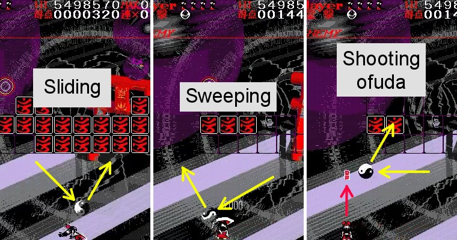

Clear regular stages by making the orb pass through all the cards.

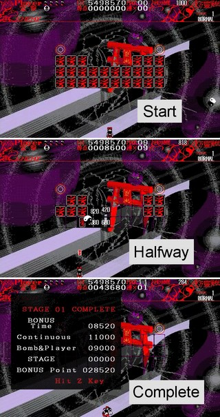

Defeat bosses by making the orb hit the boss.

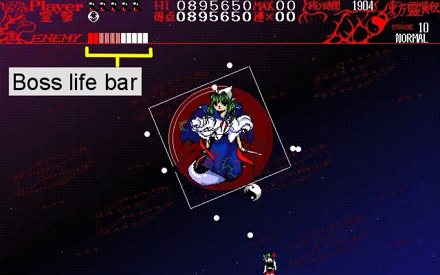

You start out with 5 lives by default. If you get hit by the orb, bullets, or other enemy attacks, you lose a life.

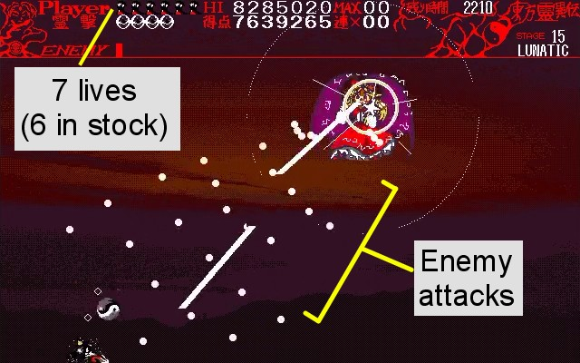

As Touhou games generally go, there are 4 difficulty levels: Easy, Normal, Hard, and Lunatic. At higher difficulties, there are more bullets and they're faster.

Some of your attacks can repel bullets, but they each have limitations.

- Ofuda are small and can only travel straight up.
- Sweeping is vulnerable at the last part of the animation.
- Spin kicks can only be performed after a slide, and the input timing is fairly specific.

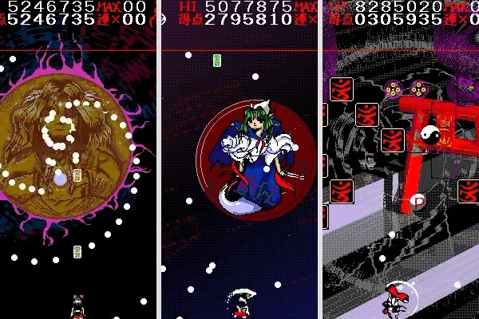

If you're in a tough situation, you can use a bomb to make yourself invincible for several seconds.

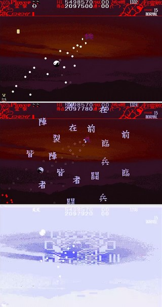

(Note: the bomb's screen-flashing is rather intense. Don't stare too closely.)

Bombs can also clear out cards in regular stages. Bombs will only damage bosses if you're on your last life.

You get one bomb when you lose a life. Also, you'll occasionally see Bomb-UP items.

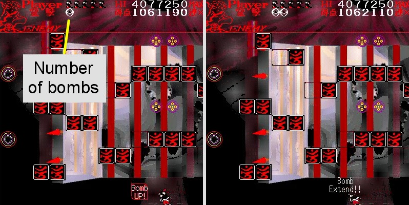

If you lose all your lives, you have to continue from the start of the stage you were on, and your score resets.

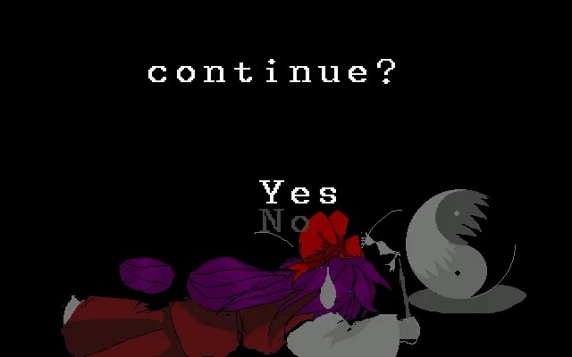

Getting a "1 credit clear" (1cc) means clearing the game without using a continue.

You get extra lives as your score increases. If you clear many cards in a single chain, each card is worth more points. To keep your chain going, don't let the orb touch the ground.

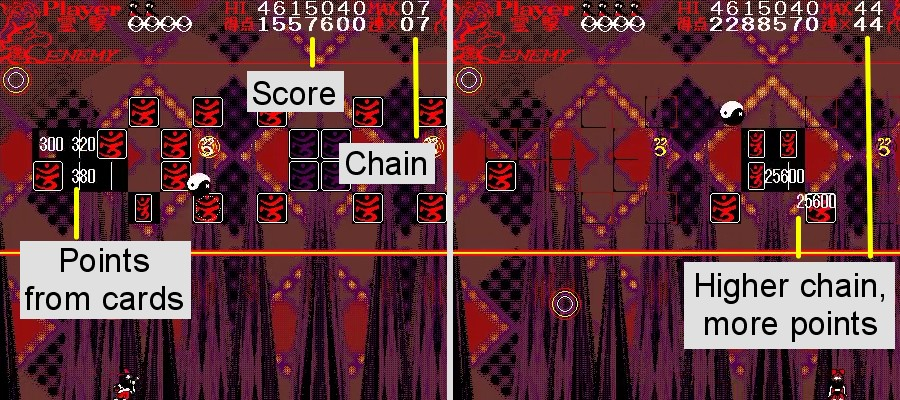

You also get big points if you collect many 'P' items in a row without missing any. A 'P' item appears for every 10 cards you clear.

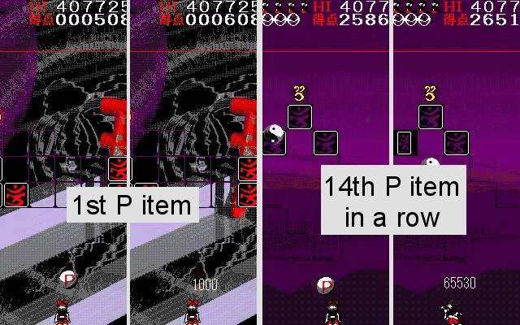

After the first boss, you can choose between the Makai route (mis-translated as "Heaven" here) or the Hell route. Each route has different stages and bosses.

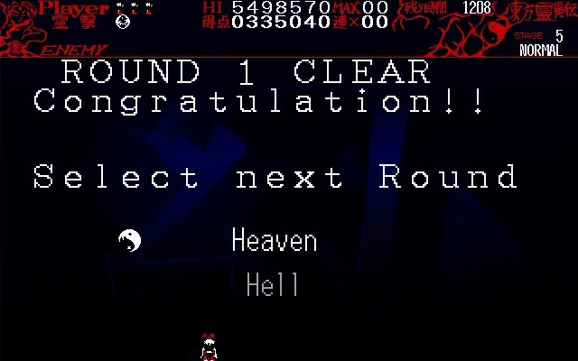

## Q&A

Q. How do I get this game?

A. This is one of the Touhou games released for PC-98 series computers. Very few copies of these games exist. You might see listings of these PC-98 games on suruga-ya, on the order of 1,000,000 yen (about $10,000 USD).
You'll also need a PC-98 series computer to play them. I'm not sure which computer model(s) will work best, but most of them on eBay go for over $1,000 USD as of 2020.

Q. Okay, how do I emulate this game?

A. Neko Project II (fmgen version) is probably your best bet. Here's a guide for setting it up: [https://pc-98s.tumblr.com/post/169630497940](https://pc-98s.tumblr.com/post/169630497940)
For Highly Responsive to Prayers, I find that setting Neko Project II's CPU speed to 48x works well. 32x works for the vast majority of the game, with one exception: the game slows to half speed during Sariel's red-dots attack on Lunatic.

